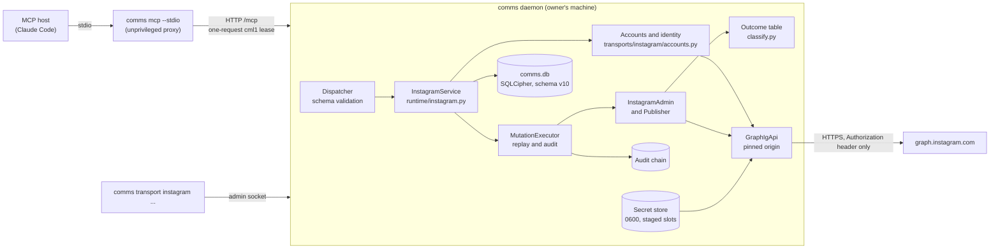
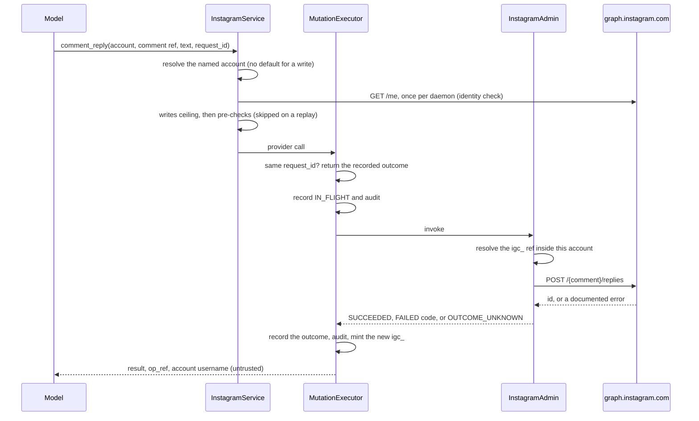
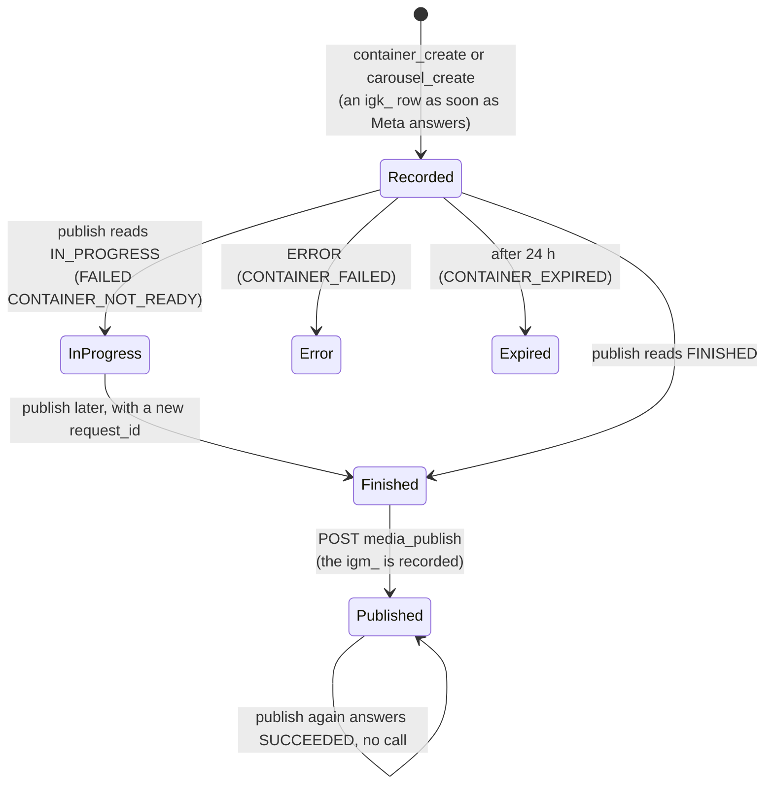

# Architecture

How the Instagram actor fits inside comms. The specification ([`SPEC.md`](SPEC.md)) is the
authority; this page is the map. Paths are relative to the comms repository
([`Raoof128/telegram-mcp`](https://github.com/Raoof128/telegram-mcp), branch
`comms-instagram-spec`).

## Components

| Module | Job |
|---|---|
| `src/comms/transports/instagram/http.py` | `GraphIgApi`: the one network client, pinned to `https://graph.instagram.com`, with a closed set of edges and the token in the header only |
| `src/comms/transports/instagram/accounts.py` | Resolves an alias to an account and runs the lazy identity check once per daemon lifetime |
| `src/comms/transports/instagram/admin.py` | The write adapter: resolves refs inside the target account, makes one Graph call per write |
| `src/comms/transports/instagram/publish.py` | Containers, carousels and publish on the `igk_` ledger |
| `src/comms/transports/instagram/classify.py` | Meta's documented error pairs mapped to fixed codes; everything else is `OUTCOME_UNKNOWN` |
| `src/comms/transports/instagram/urls.py` | Checks a media URL before it is handed to Meta |
| `src/comms/runtime/instagram.py` | `InstagramService`: every tool's logic, cursors, the write path and pre-checks |
| `src/comms/runtime/operator/instagram.py` | The operator commands: `account add`, `list`, `remove`, `token refresh`, `doctor` |
| `src/comms/mcp/tools/instagram.py` | The 22 tool schemas |

## A write, step by step

A CREATE is never retried. If the answer is lost, the outcome stays `OUTCOME_UNKNOWN`, and a
replay of the same `request_id` returns that record without calling Meta again.

## The publishing ledger

Publishing is three separate CREATEs, each with its own `request_id`, so each finishes inside
one call and nothing ever polls.

- **Budget.** The ledger counts every container made in the last 24 hours against Meta's 400.
  A full ledger answers `CONTAINER_BUDGET` before any call, and a full live post quota answers
  `PUBLISH_CAP`.
- **Crashes.** A container is recorded the moment Meta returns its id, so a crash never hides
  one from the budget.
- **Carousels.** A carousel takes 2 to 10 child containers of the same account. A child of
  another account is `NOT_FOUND`.
- **Preview.** `publish_preview` reports what a create would do, and returns an advisory
  `preview_digest` that the create can echo.

## Storage

Schema v10 adds three tables to `comms.db` and changes none:

| Table | Holds |
|---|---|
| `instagram_accounts` | Alias, `iga_` ref and Instagram user id, bound once; token expiry and the last identity check |
| `instagram_containers` | One `igk_` per Meta container: kind, creation time, status and the published `igm_` |
| `instagram_objects` | One `igm_`, `igc_` or `igp_` per account, kind and provider id |

Provider ids live only inside the encrypted database. They reach the owner through
`comms_admin_identity_inspect` and never reach the model.

## Trust boundaries

| Boundary | Rule |
|---|---|
| Model to daemon | Refs and text only. A ref names an object inside one account |
| Content to authority | Captions, comments and DMs are `untrusted_text`, never instructions |
| Daemon to Meta | One pinned origin, the token in the header, a pinned API version (only the token refresh is unversioned, as Meta documents it) |
| Model-supplied URL | Checked (`https`, public name, no IP, no userinfo, port 443) and never fetched |
| Host confirmation | Every write is in the ask list; four also carry `requiresUserInteraction` |
| Operator commands | Over the admin socket, never as MCP tools; tokens only at a hidden prompt |
